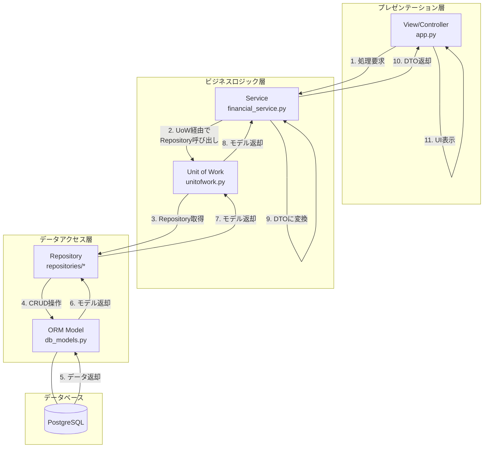
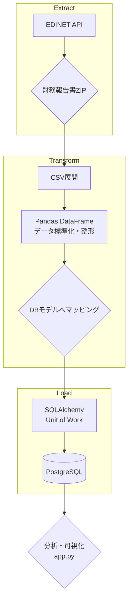
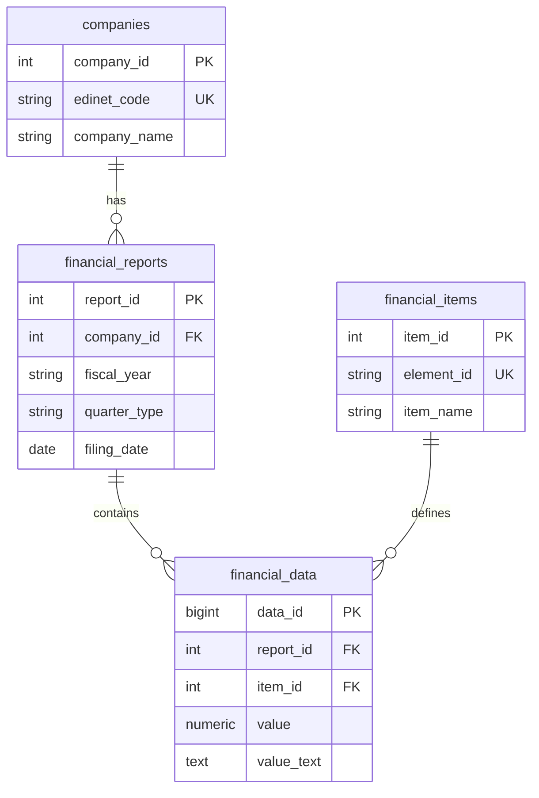

# IR分析・ETLプロジェクト

## 1. はじめに
こんにちは、島崎啓一と申します。
現在、就労移行支援事業所Neuro Diveでの訓練を通じてデータエンジニアやインフラエンジニア等の職種にキャリアチェンジを目指しています。

## 2. プロジェクトの目的と背景
### 目的
企業の財務データを一元管理・可視化し、経営判断やIR分析を効率化するためのETL・分析基盤をスクラッチで構築すること。また、その過程を通じて、保守性・拡張性に優れた実用的なアプリケーションの設計・開発スキルを証明すること。

### 背景
データエンジニアへのキャリアチェンジを目指すにあたり、実社会に存在する複雑で不整形なデータを扱い、収集（Extract）、加工（Transform）、格納（Load）するという一連のデータパイプラインを自ら設計・実装する経験が不可欠だと考えました。企業のIR情報は、その信頼性と構造の複雑さから、この挑戦に最適な題材であると判断し、本プロジェクトを開始しました。

## 3. デモ


## 4. アーキテクチャ
本プロジェクトは、アプリケーションとしての側面と、データパイプラインとしての側面を持っています。それぞれの設計思想を以下に示します。

### 4.1. アプリケーションアーキテクチャ
保守性と拡張性を重視し、責務が明確な3層アーキテクチャを採用しています。



### 4.2. データフロー (ETL)
EDINET APIからのデータ取得、整形・加工、データベースへの格納までの一連のデータパイプラインです。



### 4.3. データモデル (ER図)
収集したデータを格納するPostgreSQLデータベースの主要なテーブル構成です。



## 5. こだわった点・アピールポイント

- **クリーンアーキテクチャの実践**: 保守性とテスト容易性を高めるため、以下の設計パターンを導入しました。
  - **3層アーキテクチャ**: UI、ビジネスロジック、データアクセスを明確に分離。これにより、各層が独立して変更・テスト可能になります。
  - **Repository & Unit of Work パターン**: データソースへのアクセスを抽象化し、トランザクション管理を一元化。ビジネスロジックから永続化の詳細を隠蔽し、コードの関心事を分離しました。
- **Dockerによる環境の完全再現**: `docker-compose.yml`により、ワンコマンドで開発環境を構築できます。Pythonのバージョン、DB、ライブラリの依存関係をコンテナに閉じ込めることで、環境差異による問題を解消しています。
- **コード品質とCI/CD**: `Ruff`による静的解析とフォーマットの強制、`pytest`によるユニットテストを導入。これらをGitHub Actions上で自動実行することで、コードの品質と一貫性を継続的に担保しています。
- **技術選定へのこだわり**:
  - **SQLAlchemy**: ORMの生産性と、複雑な集計にも対応できる柔軟性を両立するために採用しました。
  - **Streamlit**: データ分析アプリケーションのUIを迅速に構築でき、バックエンドのETL処理やビジネスロジックの実装に集中するために選びました。

## 6. 技術スタック
| カテゴリ | 技術 |
| :--- | :--- |
| **言語** | Python 3.12 |
| **フレームワーク** | Streamlit, SQLAlchemy |
| **ライブラリ** | Pandas, Altair, requests |
| **データベース** | PostgreSQL 15 |
| **インフラ** | Docker, Docker Compose |
| **CI/CD** | GitHub Actions |
| **その他** | Ruff, uv, pytest |

## 7. ディレクトリ構成
```
.
├── app/                    # Streamlitアプリケーション本体
│   └── app.py
├── config/                 # 設定ファイル
│   └── config.toml
├── documents/              # 設計・ロードマップ関連ドキュメント
├── download/               # EDINETからダウンロードした生データ（CSV）
├── scripts/                # データインポート等のバッチスクリプト
│   ├── import_financial_data.py
│   └── bypass_import_csv.py
├── sql/                    # DB初期化用のDDL
│   └── ddl.sql
├── tests/                  # テストコード
├── utils/                  # アプリケーションのコアロジック
│   ├── api.py              # EDINET APIクライアント
│   ├── data_mapper.py      # データ変換ロジック
│   ├── db_models.py        # SQLAlchemy ORMモデル
│   ├── parser.py           # テキスト解析ユーティリティ
│   ├── repositories/       # Repositoryパターン実装
│   └── service/            # Service層・Unit of Work実装
├── docker-compose.yml      # サービス構成定義
└── Dockerfile              # コンテナイメージ定義
```

## 8. セットアップ方法
### 必要なもの
- Docker / Docker Compose
- Git

### 1. リポジトリのクローン
```sh
git clone https://github.com/Zack-K/ir_analyses.git
cd ir_analyses
```

### 2. 環境変数の設定
プロジェクトルートに`.env`ファイルを作成し、以下の情報を設定してください。
APIキーは、EDINETの公式サイトから取得できます。詳細は[EDINET APIのドキュメント](https://disclosure.edinet-fsa.go.jp/EKW0EZ0015.html)をご参照ください。

```.env.example
# データベース設定（機密情報）
DB_USER=user
DB_PASSWORD=password
DB_HOST=db
DB_PORT=5432
DB_NAME=mydatabase

# EDINET API設定
EDINET_API_KEY=YOUR_EDINET_API_KEY

# アプリケーション設定
DATABASE_URL=postgresql://${DB_USER}:${DB_PASSWORD}@${DB_HOST}:${DB_PORT}/${DB_NAME}
```

### 3. Dockerイメージのビルド・起動
以下のコマンドで、すべてのサービスをビルドし、バックグラウンドで起動します。
```sh
docker compose up --build -d
```
初回起動時、`sql/ddl.sql`に定義されたスキーマでデータベースが自動的に初期化されます。

### 4. 財務データのインポート
分析対象のデータをEDINET APIから取得し、データベースに保存します。
`data_processor`コンテナ内で、以下のコマンドを実行してください。

```sh
# 例: 2024年2月9日に提出された財務データをインポートする場合
docker compose exec data_processor python /scripts/import_financial_data.py 2024-02-09
```

### 5. アプリケーションへのアクセス
ブラウザで **[http://localhost:8501](http://localhost:8501)** を開いてください。

### 6. テストの実行（任意）
`streamlit_app`コンテナ内でテストを実行できます。
```sh
docker compose exec streamlit_app pytest
```

## 9. 現在の課題・今後の拡張計画
- **分析機能の強化**: 前期比較機能、キャッシュフロー分析など、新たな分析指標を追加。
- **データパイプラインの高度化**:
  - **ワークフロー管理**: `Apache Airflow`などのオーケストレーションツールを導入し、データ取得・処理の定期実行と依存関係の管理を実現。
- **パフォーマンス改善**: 大規模データ処理を想定した、DBのクエリチューニングやインデックス戦略の見直し。
- **テストの拡充**: テストカバレッジの向上とE2Eテストの導入による、アプリケーション全体の動作保証。
