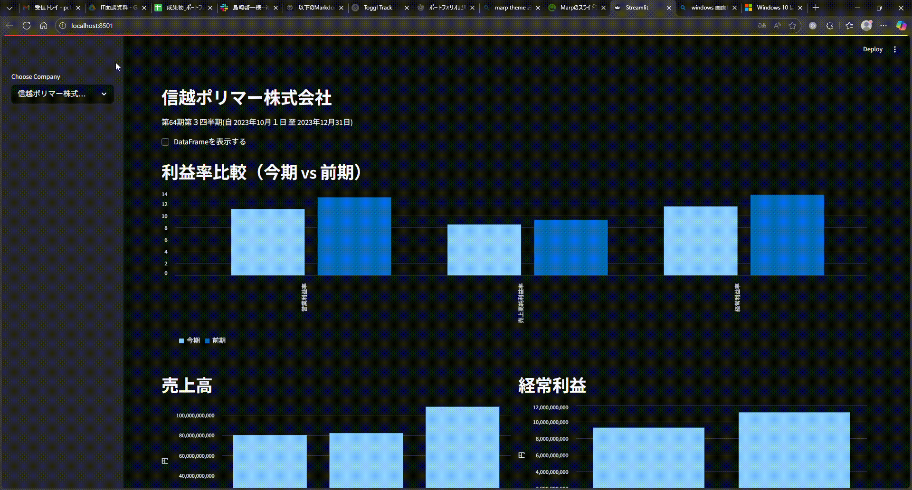
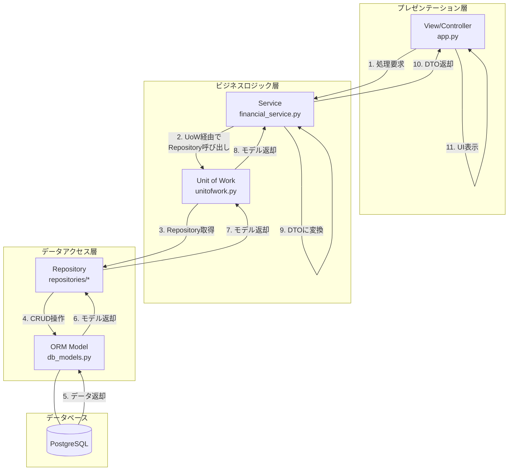

# IR分析・ETLプロジェクト

## 1. はじめに
こんにちは、島崎啓一と申します。
現在、就労移行支援事業所Neuro Diveでの訓練を通じてデータエンジニアやインフラエンジニア等の職種にキャリアチェンジを目指しています。

## 2. プロジェクトの目的
企業の財務データを一元管理・可視化し、経営判断やIR分析を効率化するためのETL・分析基盤をスクラッチで構築しています。本プロジェクトは、保守性・拡張性に優れた実用的なアプリケーション設計・開発スキルを証明することを目的としています。

## 3. アーキテクチャと主要機能

本プロジェクトは、責務の分離を目的とした3層アーキテクチャを全面的に採用しています。



### アーキテクチャ図



### 主な機能
- **データインポート**: EDINET APIから指定した日付の財務報告書（CSV）を取得し、PostgreSQLデータベースに永続化します。
- **データ可視化**: Streamlit製のダッシュボードで、企業を選択すると以下の財務指標をグラフと共に表示します。
  - 売上高、営業利益、経常利益、純利益
  - 売上高利益率、営業利益率、経常利益率
- **バッチ処理**: データインポート処理は独立したスクリプトとして実行可能です。

## 4. こだわった点・アピールポイント

- **クリーンアーキテクチャの実践**: 保守性とテスト容易性を高めるため、以下の設計パターンを導入しました。
  - **3層アーキテクチャ**: UI（`app`）、ビジネスロジック（`utils/service`）、データアクセス（`utils/repositories`）を明確に分離。
  - **Repository & Unit of Work パターン**: データソースへのアクセスを抽象化し、トランザクション管理を一元化することで、ビジネスロジックから永続化の詳細を隠蔽。
- **Dockerによる環境の完全再現**: `docker-compose.yml`により、Webアプリ、データ処理環境、DBを含むすべての開発環境をワンコマンドで構築できます。非rootユーザーでの実行など、セキュリティにも配慮しています。
- **コード品質へのこだわり**: `Ruff`による静的解析とフォーマットの強制、`pytest`によるユニットテストを通じて、コードの品質と一貫性を担保しています。

## 5. 技術スタック

| カテゴリ | 技術 |
| :--- | :--- |
| **言語** | Python 3.12 |
| **フレームワーク** | Streamlit, SQLAlchemy |
| **ライブラリ** | Pandas, Altair, requests |
| **データベース** | PostgreSQL 15 |
| **インフラ** | Docker, Docker Compose |
| **CI/CD** | GitHub Actions |
| **その他** | Ruff, uv, pytest |

## 6. セットアップ方法

本プロジェクトはDockerを用いて簡単にセットアップできます。

### 必要なもの
- Docker / Docker Compose
- Git

### 1. リポジトリのクローン
```sh
git clone https://github.com/Zack-K/ir_analyses.git
cd ir_analyses
```

### 2. 環境変数の設定
プロジェクトルートに`.env`ファイルを作成し、ご自身のEDINET APIキーを設定してください。
APIキーは、EDINETの公式サイトから取得できます。詳細は[EDINET APIのドキュメント](https://disclosure.edinet-fsa.go.jp/EKW0EZ0015.html)をご参照ください。

```.env
EDINET_API_KEY="YOUR_EDINET_API_KEY"
```

### 3. Dockerイメージのビルド・起動
以下のコマンドで、すべてのサービスをビルドし、バックグラウンドで起動します。
```sh
docker compose up --build -d
```
初回起動時、`sql/ddl.sql`に定義されたスキーマでデータベースが自動的に初期化されます。

### 4. 財務データのインポート
分析対象のデータをEDINET APIから取得し、データベースに保存します。
`data_processor`コンテナ内で、以下のコマンドを実行してください。

```sh
# 例: 2024年2月9日に提出された財務データをインポートする場合
docker compose exec data_processor python /scripts/import_financial_data.py 2024-02-09
```

### 5. アプリケーションへのアクセス
ブラウザで **[http://localhost:8501](http://localhost:8501)** を開いてください。

### 6. テストの実行（任意）
`streamlit_app`コンテナ内でテストを実行できます。
```sh
docker compose exec streamlit_app pytest
```

## 7. 今後の拡張計画
- 前期比較機能の実装
- キャッシュフロー分析など、新たな分析指標の追加
- データ更新処理のバッチ化・スケジューリング（例: Airflowの導入）
- テストカバレッジの向上とE2Eテストの導入