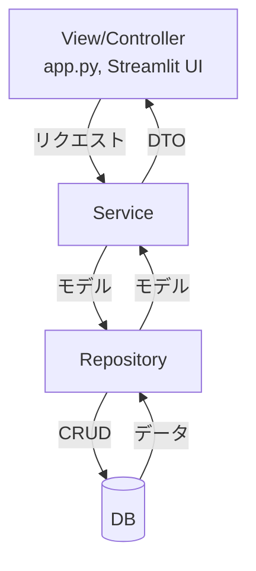
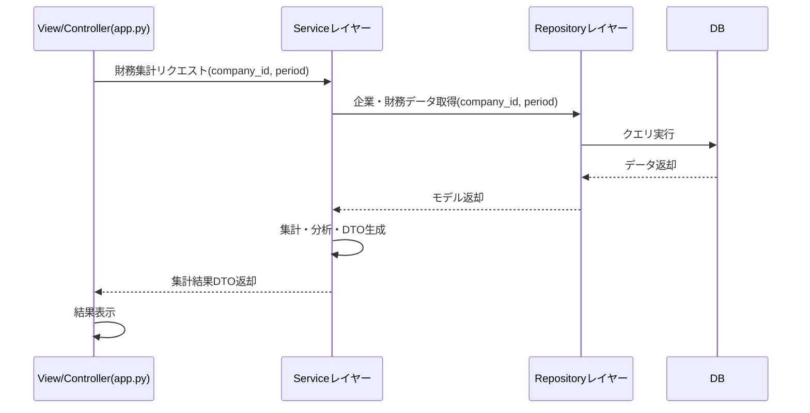

# IR分析プロジェクト 完成版ロードマップ・設計方針（統合版）

## 0. 本プロジェクトのIssues管理先
- https://github.com/users/Zack-K/projects/2/views/1

## 1. はじめに

本ドキュメントは、IR分析プロジェクトのMVP（Minimum Viable Product）から完成版へと進化させるための、開発ロードマップと設計方針を統合的にまとめたものです。  
PM・シニアエンジニア・スクラムマスターの視点から、2週間スプリント単位での優先タスク、アーキテクチャ、リファクタリング方針を明確化します。

---

## 1.5. 現在の進捗状況 (2025-09-13時点)

`refactoring_roadmap.md` に基づくリファクタリングプロジェクトの進捗は、概算で約80%です。

- **ステップ1: DBモデルの強化**: `完了`
- **ステップ2: Repositoryパターンの導入**: `完了`
- **ステップ3: Service層の構築**: `進行中 (50%)`
  - データ読み取り機能は実装済み。データ永続化機能が未実装。
- **ステップ4: UIとバックエンドの連携**: `完了`
- **ステップ5: テストの刷新**: `進行中 (60%)`
  - Repository層・Mapper層のテストは実装済み。Service層のテストが未実装。

### 残存する主要タスク

1.  **データ永続化ロジックの実装**: `FinancialService`に、CSVから読み込んだデータをDBに保存するメソッドを実装する。
2.  **Service層のテスト**: `FinancialService`のビジネスロジックに対するユニットテストを実装する。

---

## 2. 現状と課題

### 2.1. 現状（MVP版）

- 企業財務データのCSV直読による可視化（Streamlit UI）
- DBやAPI連携は未実装
- UIとデータ処理ロジックが密結合
- テスト・運用面は最小限

### 2.2. 主な課題

- データ永続化・取得のためのDB連携が未着手
- ビジネスロジックとデータアクセスの責務分離が不十分
- 拡張性・保守性・テスト容易性に課題
- 複数企業比較や期間選択など、分析機能の拡充が必要
- **データ取得・更新の自動化**: 現在のデータ取得プロセスは手動実行が前提であり、定期的に最新の状態を維持するための仕組み（データパイプライン）が存在しない。（Apache Airflowの導入を検討）

### 2.3. 実装レビューで特定された技術的課題 (2025-09-27時点)

`FinancialService`のデータ永続化機能の実装方針レビューを通じて、パフォーマンス、堅牢性、保守性の観点から以下の技術的課題が特定された。これらは今後の実装およびリファクタリングで対応する必要がある。

#### 1. データ永続化層のパフォーマンスと堅牢性

- **課題1: N+1クエリ問題**
    - **内容**: `Financial_item`の存在確認をループ内で1件ずつ行っており、データ量に比例してDBへの問い合わせが増加し、パフォーマンスが著しく低下する懸念がある。
    - **対策**: 登録前に`element_id`をまとめてリスト化し、`IN`句を用いた一括問い合わせに切り替えることで、DBアクセスを最小限に抑える。

- **課題2: データの重複登録リスク**
    - **内容**: `Financial_data`を単純に`add`するロジックでは、同じレポートを再処理した際にデータが重複して登録されてしまう。
    - **対策**: 特定の`Financial_report`に紐づく既存の`Financial_data`を一度削除してから新しいデータを一括挿入する「洗い替え」方式を導入し、データの整合性を保証する。

- **課題3: 曖昧なUpsertロジック**
    - **内容**: `session.merge`を利用した汎用的な`upsert`は主キーに基づいており、`edinet_code`のような業務キーでのUpsert（Update or Insert）を意図したものではない。
    - **対策**: サービス層に「Find-or-Create」パターンを明示的に実装する。業務キーでエンティティを検索し、存在すれば更新、存在しなければ新規作成するというロジックに修正し、処理の意図を明確にする。

#### 2. トランザクション管理の最適化

- **課題: 暗黙的なトランザクション制御とID取得の問題**
    - **内容**: SQLAlchemyのデフォルトである`autoflush=True`に依存すると、DBへの書き込みタイミングが暗黙的で制御しにくい。その結果、`Company`登録後に`company_id`が取得できず、後続の`Financial_report`登録に失敗する問題が発生する。
    - **対策**: セッション生成時に`autoflush=False`を明示的に設定する。そして、後続処理でIDが必要となる直前のタイミングで`session.flush()`を明示的に呼び出す。これにより、DBへの書き込みタイミングを完全に制御し、コードの可読性と堅牢性を向上させる。

#### 3. DBモデルの改善

- **課題: 過剰なユニーク制約**
    - **内容**: `financial_items`テーブルの`item_name`カラムにユニーク制約が存在するが、異なる`element_id`が同じ`item_name`を持つ可能性がある。
    - **対策**: `element_id`のユニーク性で十分であるため、`item_name`のユニーク制約は削除を検討する。これにより、将来のデータ多様性への対応が容易になる。

---

## 3. 完成版に向けたアーキテクチャ方針

### 3.1. 3層構造の採用
#### 3層構造の概要

- **View/Controller（app.py, Streamlit UI）**
   - ユーザー操作受付・結果表示のみを担当。Serviceレイヤーの呼び出しに特化。
   - api.pyのstandardize_raw_data以降は全てServiceレイヤーに移植。
- **Serviceレイヤー**
   - ビジネスロジック・DTO（Data Transfer Object）/DataFrame変換・トランザクション管理を担当。
   - 複数Repositoryを組み合わせてデータ加工・集計を行う。
   - api.pyから移植されたロジックに上記機能から不足している機能を追加で実装。
- **Repositoryレイヤー**
   - SQLAlchemy ORMを用いたDBアクセスに特化。モデルオブジェクトのCRUD操作をカプセル化。

---

### 3.1.1. アーキテクチャの原則と責務の詳細（追記）

ここまでの議論に基づき、各レイヤーの責務と原則をより明確化する。

- **全体構成:** 本プロジェクトは、責務分離を目的とした古典的な **3層アーキテクチャ** を採用する。
  - **プレゼンテーション層:** `app.py` (Controller/View)
  - **ビジネスロジック層:** `Service`
  - **データアクセス層:** `Repository`

- **ビジネスロジックの実装方針:**
  - ビジネスロジックは **Service層に集約**する。これは、手続き的に処理を記述する「**トランザクションスクリプト**」パターンに分類される。これはDDD（ドメイン駆動設計）への入り口として、クリーンアーキテクチャの非常に現実的で優れた実践である。

- **各レイヤーの厳密な責務:**
  - **View/Controller (`app.py`):**
    - **責務:** ユーザー操作の受付と、Serviceへの処理依頼に特化する「**アプリケーション操作の窓口**」。
    - **原則:** DBやモデルオブジェクトの存在を**意識しない**。Serviceから返されたDTOやDataFrameを利用して表示のみを行う。
  - **Serviceレイヤー:**
    - **責務:** Service層は、以下の3つの主要な責務を担う「ビジネスの頭脳」である。
      1.  **ビジネスロジックの実行:** アプリケーション固有のルール、計算、判断を行う。
      2.  **データ永続化の調整:** `Unit of Work`パターンを通じてリポジトリの呼び出しを調整し、データ操作の順序や組み合わせを制御する。
      3.  **データ変換（マッピング）:** Repositoryから受け取ったDBモデルを、UI（プレゼンテーション層）が扱いやすいDTO（Data Transfer Object）に変換する。また、CSVのような非構造化データから、DBモデルへマッピングするためのデータ構造（辞書など）を作成する。
    - **原則:**
      - Service層はDBアクセスを直接行わず、Repository層にデータ操作を**依頼**する。
      - データ永続化の際は、Repositoryと連携して「重複チェック」などのビジネスルールを適用した上で、永続化を指示する。
      - まずはビジネスの関心事（ドメイン）ごとにServiceクラス（例: `FinancialService`）を1つ設計し、このクラスが上記の責務を統合的に担う。
      - クラスが将来的に肥大化した場合に、責務に応じてMapperクラスや計算クラスなどへ分割するリファクタリングを検討する。
  - **Mapperレイヤー (`data_mapper.py`, `parser.py`):**
    - **責務:** 外部データ（CSVなど）とDBモデル間のデータ構造を変換する「**変換器**」。
    - **原則:** **ビジネスロジックや、DBへの永続化・問い合わせロジックを一切持たない**。DBの存在を意識せず、純粋なデータ変換処理に特化する。
  - **Repositoryレイヤー:**
    - **責務:** SQLAlchemyモデルオブジェクトのCRUD操作を通じた「**永続化の抽象化**」。
    - **原則:** **ビジネスロジックを一切持たない**。`find_by_id`のような検索ロジックは持つが、計算などのビジネスルールは含まない。Serviceに対しては、常に**モデルオブジェクト（またはそのリスト）**を返す。

- **Unit of Work パターンと依存性の注入:**
  - **Unit of Work (UoW) の導入:** 複数のRepositoryを束ね、トランザクション管理を一元化する`Unit of Work`パターンを導入する。
    - **役割1 (トランザクション管理):** `with`文と連携し、トランザクションの開始、コミット、ロールバックを自動的に行う。
    - **役割2 (統一アクセス窓口):** すべてのRepositoryインスタンスをプロパティとして保持する。
  - **依存性の注入 (DI):**
    - Serviceは、コンストラクタで個別のRepositoryではなく、`UnitOfWork`オブジェクトを一つだけ受け取る。
    - これにより、Serviceとデータアクセス層の結合を疎に保ち、テスト容易性を最大化する。

---

#### 各レイヤーの現状と今後

- **Controllerレイヤー（api.py, app.py）**
   - 現状：リクエスト受付・データ処理・DBアクセスまで一部を担っており、特にapi.pyではビジネスロジックやデータ変換・DB操作が混在し、責務分離が不十分。
   - 今後：リクエスト受付・レスポンス生成・Service層の呼び出しに特化。ビジネスロジックやDB操作はService/Repository層に委譲し、UI/外部APIからのリクエスト処理をシンプル化。保守性・テスト容易性が向上。

- **Serviceレイヤー**
   - 現状：明確なService層は未実装で、ビジネスロジックやデータ変換処理がapi.py等に集約されている。
   - 今後：ビジネスロジック・DTO/DataFrame変換・トランザクション管理を集約。複数Repositoryを組み合わせた集計・加工も担当。Controller層から呼び出されることで、責務分離・テスト容易性・拡張性が向上。

- **Repositoryレイヤー（db_models.py, db_controller.py）**
   - 現状：db_models.py（モデル定義）とdb_controller.py（DBアクセス）が対応し、現状のRepositoryレイヤーの役割を果たしている。
   - 今後：db_controller.pyの手続き的関数群を廃止し、各モデルごとにRepositoryクラスを新設。DBアクセス・CRUD操作をカプセル化し、責務分離・拡張性・テスト容易性を高める。

---

#### ユースケースと設計方針

本プロジェクトの主要ユースケースは「app.pyで行っている財務指標の集計・表示」であり、今後の分析指標拡張にも柔軟に対応できる設計とする。

- **DTO設計方針**
   - Controller（app.py）⇔Service層⇔Repository層間で、集計結果や企業情報などをやり取りするためのデータ構造。
   - 例：
      - CompanyDTO（企業ID、企業名、EDINETコードなど）
      - FinancialSummaryDTO（売上高、営業利益、経常利益、純利益、各種利益率、期間情報）
      - ProfitRateDTO（営業利益率、経常利益率、純利益率、期間情報）
   - 新たな分析指標追加時はDTOに項目追加で対応可能。

- **Serviceレイヤー設計方針**
   - 責務：DataFrameやDBから必要なデータを取得・集計し、DTOに変換して返却。複数企業・期間の比較や分析指標の計算ロジックを集約。
   - Repository層の呼び出し・トランザクション管理も担当。
   - 例：
      - FinancialService.get_financial_summary(company_id, period) → FinancialSummaryDTO
      - FinancialService.get_profit_rates(company_id, period) → ProfitRateDTO
      - FinancialService.compare_companies(company_ids, period) → List[FinancialSummaryDTO]
   - 新しい分析ロジックや集計処理はService層に追加することで、UIやRepository層への影響を最小限に抑えられる。

- **Repositoryレイヤー設計方針**
   - SQLAlchemy ORMを用いたDBアクセスに特化。モデルオブジェクトのCRUD操作をカプセル化。
   - db_controller.pyの手続き的関数群を廃止し、各モデルごとにRepositoryクラスを新設。
   - 検索キーとなるカラムに`index`を追加し、パフォーマンス向上
   - Upsert（Update or Insert）ロジックをRepositoryに実装

## 3.2. アーキテクチャ図（Mermaid）

---

## 3.3. 主要ユースケースのシーケンス図（Mermaid）

### 3.3. 責務分離とテスト容易性

- 各レイヤーの責務を明確化し、密結合を排除
- テストはモデルオブジェクトのプロパティ検証を中心に、トランザクション管理を徹底
- CI/CD（GitHub Actions）による自動テスト・ビルド

### 3.4. エラーハンドリング方針（既存コード準拠）

1. **例外発生時は必ずloggerでエラー内容を記録する**
   - logger.error()やlogger.warning()を用いて、例外発生箇所・内容・該当データを詳細に記録する。

2. **DB操作（insert, read, update, delete）はtry-except-finallyで囲む**
   - SQLAlchemyErrorなどのDB例外を捕捉し、session.rollback()でトランザクションをロールバックする。
   - 失敗時はFalseや空のDataFrameを返却し、処理を継続可能にする。

3. **ファイル・設定読み込み時は複数パスを試行し、失敗時は警告ログを残す**
   - try-exceptでファイル読み込み例外を捕捉し、logger.warning()で通知する。

4. **API通信・外部リソース取得時はrequests.exceptions.RequestException等を捕捉し、エラー時はNoneや空データを返す**
   - 例外発生時はlogger.error()で詳細を記録する。

5. **データ抽出・変換時はKeyErrorやIndexErrorを捕捉し、エラー時はNoneを返す**
   - 必須項目が取得できない場合はValueErrorを送出し、logger.error()で記録する。

6. **finally句で必ずリソース（DBセッション等）をクローズする**

## 4. 開発ロードマップ

具体的なリファクタリングのステップは、**`refactoring_roadmap.md`** で詳細に管理します。

---

## 5. リファクタリング方針（各ファイルの役割）

### 5.1. `db_models.py`
- モデル間の`relationship`追加
- インデックス設定
- オブジェクト指向設計の徹底

### 5.2. `db_controller.py` → Repositoryクラス群
- 手続き的関数群を廃止
- モデルごとのRepositoryクラス新設
- Upsert・トランザクション管理の実装

### 5.3. `api.py`
- DataFrameからモデルオブジェクトへのマッピングに責務集中
- DB操作はService/Repositoryに委譲

### 5.4. Serviceレイヤー
- ビジネスロジック・DTO/DataFrame変換
- 複数Repositoryの組み合わせ
- トランザクション管理

### 5.5. `app.py`
- UIロジックとビジネスロジックの分離
- Streamlitの`st.connection`機能を用いたDBセッションの管理
- 取得したセッションをServiceレイヤー（またはUnit of Work）に注入（Dependency Injection）
- Serviceレイヤーの呼び出しと、結果の表示に特化
- 読み取り専用処理において`st.cache_data`を利用したパフォーマンス最適化

---

## 6. テスト・運用面の強化

### 6.1. MVP達成に向けたテスト計画

MVP（DBへのInsert/SelectとUIでのデータ表示）の品質を保証するため、以下の計画に基づきテストを実装します。

#### 6.1.1. テスト方針

- **MVP要件:**
    1.  **データ永続化 (Insert):** CSV等のソースからDBへデータを正しく保存できる。
    2.  **データ表示 (Select):** DBから読み取ったデータをUIに正しく表示できる。
- **テスト方針:**
    MVPのコア機能である**Service層**、およびその信頼性を担保する**Unit of Work**と**Repository層**にテストを集中させます。

#### 6.1.2. テストの優先順位と工数見積もり

> [!NOTE]
> **1ポイント** = 1人の開発者が集中環境で**約半日（4時間）**で完了できる作業量。

| 優先度 | テスト対象 | 見積工数 (ポイント) | 役割とMVPへの貢献 |
| :--- | :--- | :--- | :--- |
| **1 (最重要)** | **Service層** (`FinancialService`) | **8** | MVPの要件である「DBへのInsert/Select」というビジネスロジックそのものを担う。ここのテストはMVPの機能仕様を直接保証する。 |
| **2 (重要)** | **Unit of Work** (`SqlAlchemyUnitOfWork`) | **2** | Service層のデータ整合性を保証するトランザクション管理の基盤。Service層テストの信頼性を担保する。 |
| **3 (重要)** | **Repository層** (各Repositoryクラス) | **4** | Service層が直接依存するデータアクセス部品。Service層のテストを安定させ、問題発生時の原因切り分けを容易にする。 |
| **合計** | **MVP重点範囲** | **14** | **(所要日数目安: 約7日)** |

### 6.2. 従来のテスト方針

- モデルオブジェクトのプロパティ検証中心のテスト
- テストごとにトランザクションをロールバック
- CI/CDによる自動化
- バッチ実行・スケジュール化対応

---

## 7. 今後の拡張計画

- DB連携・永続化（PostgreSQL/SQLAlchemy）
- Serviceレイヤー導入による責務分離
- 企業選択の拡張（EDINETコード検索、DBから動的取得）
- 単体テスト・例外処理・運用面の強化
- **前期比較機能の実装**: UIに前期比（`st.metric`の`delta`など）を表示する。Service層に、今期と前期のデータを比較するロジックを追加し、`FinancialDataRepository`を拡張して、単一の財務報告から`context_id`（例: `CurrentYTDDuration`, `Prior1YTDDuration`）に基づいて今期・前期のデータを効率的に取得する。
- バッチ実行・スケジュール化対応

---

## 8. 結論

本ロードマップと設計方針に沿って開発を進めることで、  
MVPから完成版への進化がスムーズに実現でき、  
拡張性・保守性・テスト容易性に優れたIR分析基盤を構築できます。

今後は「DB連携」「Serviceレイヤー導入」「企業選択の拡張」「分析機能の拡充」「テスト・運用面の強化」を優先的に進めてください。