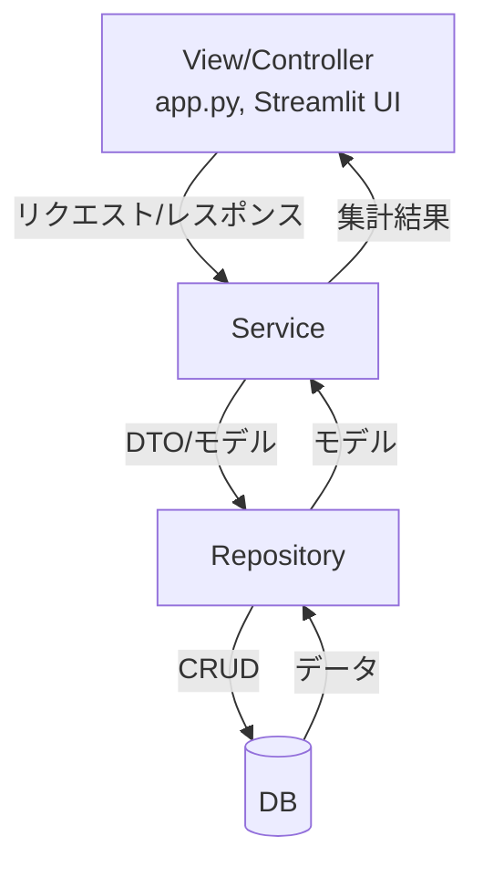
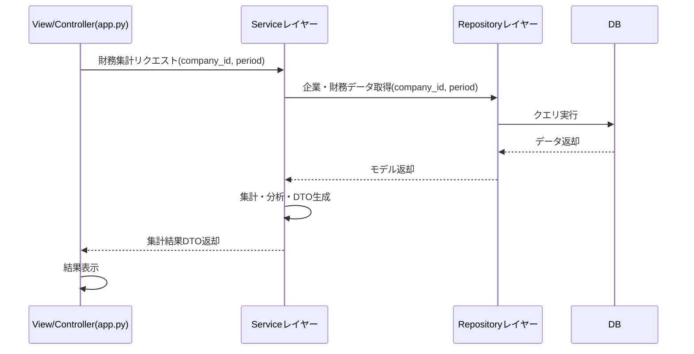

# IR分析プロジェクト 完成版ロードマップ・設計方針（統合版）

## 0. 本プロジェクトのIssues管理先
- https://github.com/users/Zack-K/projects/2/views/1

## 1. はじめに

本ドキュメントは、IR分析プロジェクトのMVP（Minimum Viable Product）から完成版へと進化させるための、開発ロードマップと設計方針を統合的にまとめたものです。  
PM・シニアエンジニア・スクラムマスターの視点から、2週間スプリント単位での優先タスク、アーキテクチャ、リファクタリング方針を明確化します。

---

## 2. 現状と課題

### 2.1. 現状（MVP版）

- 企業財務データのCSV直読による可視化（Streamlit UI）
- DBやAPI連携は未実装
- UIとデータ処理ロジックが密結合
- テスト・運用面は最小限

### 2.2. 主な課題

- データ永続化・取得のためのDB連携が未着手
- ビジネスロジックとデータアクセスの責務分離が不十分
- 拡張性・保守性・テスト容易性に課題
- 複数企業比較や期間選択など、分析機能の拡充が必要

---

## 3. 完成版に向けたアーキテクチャ方針

### 3.1. 3層構造の採用
#### 3層構造の概要

- **View/Controller（app.py, Streamlit UI）**
   - ユーザー操作受付・結果表示のみを担当。Serviceレイヤーの呼び出しに特化。
   - api.pyのstandardize_raw_data以降は全てServiceレイヤーに移植。
- **Serviceレイヤー**
   - ビジネスロジック・DTO（Data Transfer Object）/DataFrame変換・トランザクション管理を担当。
   - 複数Repositoryを組み合わせてデータ加工・集計を行う。
   - api.pyから移植されたロジックに上記機能から不足している機能を追加で実装。
- **Repositoryレイヤー**
   - SQLAlchemy ORMを用いたDBアクセスに特化。モデルオブジェクトのCRUD操作をカプセル化。

---

### 3.1.1. アーキテクチャの原則と責務の詳細（追記）

ここまでの議論に基づき、各レイヤーの責務と原則をより明確化する。

- **全体構成:** 本プロジェクトは、責務分離を目的とした古典的な **3層アーキテクチャ** を採用する。
  - **プレゼンテーション層:** `app.py` (Controller/View)
  - **ビジネスロジック層:** `Service`
  - **データアクセス層:** `Repository`

- **ビジネスロジックの実装方針:**
  - ビジネスロジックは **Service層に集約**する。これは、手続き的に処理を記述する「**トランザクションスクリプト**」パターンに分類される。これはDDD（ドメイン駆動設計）への入り口として、クリーンアーキテクチャの非常に現実的で優れた実践である。

- **各レイヤーの厳密な責務:**
  - **View/Controller (`app.py`):**
    - **責務:** ユーザー操作の受付と、Serviceへの処理依頼に特化する「**アプリケーション操作の窓口**」。
    - **原則:** DBやモデルオブジェクトの存在を**意識しない**。Serviceから返されたDTOやDataFrameを利用して表示のみを行う。
  - **Serviceレイヤー:**
    - **責務:** **ビジネスロジックの実装**と**トランザクション管理**の２つに責任を持つ。
    - **原則:** 複数のRepositoryを組み合わせてユースケースを実現する。Repositoryから受け取ったモデルオブジェクトを、Controllerが扱いやすいDTOやDataFrameに変換する。
  - **Repositoryレイヤー:**
    - **責務:** SQLAlchemyモデルオブジェクトのCRUD操作を通じた「**永続化の抽象化**」。
    - **原則:** **ビジネスロジックを一切持たない**。`find_by_id`のような検索ロジックは持つが、計算などのビジネスルールは含まない。Serviceに対しては、常に**モデルオブジェクト（またはそのリスト）**を返す。

- **依存性の注入 (Dependency Injection):**
  - RepositoryはコンストラクタでDBセッション(`Session`)を外部（Service層）から受け取る。
  - これにより、Service層でのトランザクション一元管理と、Repositoryのモック化によるテスト容易性を実現する。

---

#### 各レイヤーの現状と今後

- **Controllerレイヤー（api.py, app.py）**
   - 現状：リクエスト受付・データ処理・DBアクセスまで一部を担っており、特にapi.pyではビジネスロジックやデータ変換・DB操作が混在し、責務分離が不十分。
   - 今後：リクエスト受付・レスポンス生成・Service層の呼び出しに特化。ビジネスロジックやDB操作はService/Repository層に委譲し、UI/外部APIからのリクエスト処理をシンプル化。保守性・テスト容易性が向上。

- **Serviceレイヤー**
   - 現状：明確なService層は未実装で、ビジネスロジックやデータ変換処理がapi.py等に集約されている。
   - 今後：ビジネスロジック・DTO/DataFrame変換・トランザクション管理を集約。複数Repositoryを組み合わせた集計・加工も担当。Controller層から呼び出されることで、責務分離・テスト容易性・拡張性が向上。

- **Repositoryレイヤー（db_models.py, db_controller.py）**
   - 現状：db_models.py（モデル定義）とdb_controller.py（DBアクセス）が対応し、現状のRepositoryレイヤーの役割を果たしている。
   - 今後：db_controller.pyの手続き的関数群を廃止し、各モデルごとにRepositoryクラスを新設。DBアクセス・CRUD操作をカプセル化し、責務分離・拡張性・テスト容易性を高める。

---

#### ユースケースと設計方針

本プロジェクトの主要ユースケースは「app.pyで行っている財務指標の集計・表示」であり、今後の分析指標拡張にも柔軟に対応できる設計とする。

- **DTO設計方針**
   - Controller（app.py）⇔Service層⇔Repository層間で、集計結果や企業情報などをやり取りするためのデータ構造。
   - 例：
      - CompanyDTO（企業ID、企業名、EDINETコードなど）
      - FinancialSummaryDTO（売上高、営業利益、経常利益、純利益、各種利益率、期間情報）
      - ProfitRateDTO（営業利益率、経常利益率、純利益率、期間情報）
   - 新たな分析指標追加時はDTOに項目追加で対応可能。

- **Serviceレイヤー設計方針**
   - 責務：DataFrameやDBから必要なデータを取得・集計し、DTOに変換して返却。複数企業・期間の比較や分析指標の計算ロジックを集約。
   - Repository層の呼び出し・トランザクション管理も担当。
   - 例：
      - FinancialService.get_financial_summary(company_id, period) → FinancialSummaryDTO
      - FinancialService.get_profit_rates(company_id, period) → ProfitRateDTO
      - FinancialService.compare_companies(company_ids, period) → List[FinancialSummaryDTO]
   - 新しい分析ロジックや集計処理はService層に追加することで、UIやRepository層への影響を最小限に抑えられる。

- **Repositoryレイヤー設計方針**
   - SQLAlchemy ORMを用いたDBアクセスに特化。モデルオブジェクトのCRUD操作をカプセル化。
   - db_controller.pyの手続き的関数群を廃止し、各モデルごとにRepositoryクラスを新設。
   - 検索キーとなるカラムに`index`を追加し、パフォーマンス向上
   - Upsert（Update or Insert）ロジックをRepositoryに実装

## 3.2. アーキテクチャ図（Mermaid）

---

## 3.3. 主要ユースケースのシーケンス図（Mermaid）

### 3.3. 責務分離とテスト容易性

- 各レイヤーの責務を明確化し、密結合を排除
- テストはモデルオブジェクトのプロパティ検証を中心に、トランザクション管理を徹底
- CI/CD（GitHub Actions）による自動テスト・ビルド

### 3.4. エラーハンドリング方針（既存コード準拠）

1. **例外発生時は必ずloggerでエラー内容を記録する**
   - logger.error()やlogger.warning()を用いて、例外発生箇所・内容・該当データを詳細に記録する。

2. **DB操作（insert, read, update, delete）はtry-except-finallyで囲む**
   - SQLAlchemyErrorなどのDB例外を捕捉し、session.rollback()でトランザクションをロールバックする。
   - 失敗時はFalseや空のDataFrameを返却し、処理を継続可能にする。

3. **ファイル・設定読み込み時は複数パスを試行し、失敗時は警告ログを残す**
   - try-exceptでファイル読み込み例外を捕捉し、logger.warning()で通知する。

4. **API通信・外部リソース取得時はrequests.exceptions.RequestException等を捕捉し、エラー時はNoneや空データを返す**
   - 例外発生時はlogger.error()で詳細を記録する。

5. **データ抽出・変換時はKeyErrorやIndexErrorを捕捉し、エラー時はNoneを返す**
   - 必須項目が取得できない場合はValueErrorを送出し、logger.error()で記録する。

6. **finally句で必ずリソース（DBセッション等）をクローズする**

## 4. 2週間スプリント計画（優先タスク）

### スプリント1（1週目）

1. **設計方針の確定・ドキュメント整備**
   - [c] 3層アーキテクチャの設計レビュー
   - README・設計書のアップデート

2. **[DONE] DBモデルの強化**
   - [c] `relationship`・`index`の追加
   - [c] モデル定義のリファクタリング
      - 実績
         - 8/29 1h

3. **[DOING]Repositoryパターン導入**
   - `db_controller.py`廃止、各モデルごとにRepositoryクラス新設
   - Upsert/トランザクション管理の実装
      - 実績
         - 8/29 0.5h 

4. **Serviceレイヤー雛形作成**
   - ビジネスロジック層の新設
   - DTO/DataFrame変換の責務分離

5. **テスト基盤整備**
   - Repository単位のテスト刷新
   - トランザクション管理の徹底

---

### スプリント2（2週目）

1. **DB連携・永続化機能の実装**
   - Service→Repository→DBの流れで企業・財務データの保存・取得
   - マッピング関数のORMオブジェクト返却化

2. **UI/UXの拡張**
   - Streamlit UIのService呼び出し化
   - 企業選択・期間選択の拡張（DBから動的取得）

3. **分析機能の拡充**
   - 追加財務指標（キャッシュフロー、自己資本比率等）のグラフ化
   - 複数企業の比較表示

4. **テスト・CI/CD強化**
   - Service/Repository層の単体テスト追加
   - GitHub Actionsによる自動化

5. **運用・設定ガイドの追記**
   - Docker/ローカル環境切替、バッチ実行手順

---

## 5. リファクタリング方針（各ファイルの役割）

### 5.1. `db_models.py`
- モデル間の`relationship`追加
- インデックス設定
- オブジェクト指向設計の徹底

### 5.2. `db_controller.py` → Repositoryクラス群
- 手続き的関数群を廃止
- モデルごとのRepositoryクラス新設
- Upsert・トランザクション管理の実装

### 5.3. `api.py`
- DataFrameからモデルオブジェクトへのマッピングに責務集中
- DB操作はService/Repositoryに委譲

### 5.4. Serviceレイヤー
- ビジネスロジック・DTO/DataFrame変換
- 複数Repositoryの組み合わせ
- トランザクション管理

### 5.5. `app.py`
- UIロジックとデータ取得ロジックの分離
- Serviceレイヤー呼び出しによるデータ表示

---

## 6. テスト・運用面の強化

- モデルオブジェクトのプロパティ検証中心のテスト
- テストごとにトランザクションをロールバック
- CI/CDによる自動化
- バッチ実行・スケジュール化対応

---

## 7. 今後の拡張計画

- DB連携・永続化（PostgreSQL/SQLAlchemy）
- Serviceレイヤー導入による責務分離
- 企業選択の拡張（EDINETコード検索、DBから動的取得）
- 追加財務指標・複数企業比較・期間選択機能
- 単体テスト・例外処理・運用面の強化

---

## 8. 結論

本ロードマップと設計方針に沿って開発を進めることで、  
MVPから完成版への進化がスムーズに実現でき、  
拡張性・保守性・テスト容易性に優れたIR分析基盤を構築できます。

今後は「DB連携」「Serviceレイヤー導入」「企業選択の拡張」「分析機能の拡充」「テスト・運用面の強化」を優先的に進めてください。
