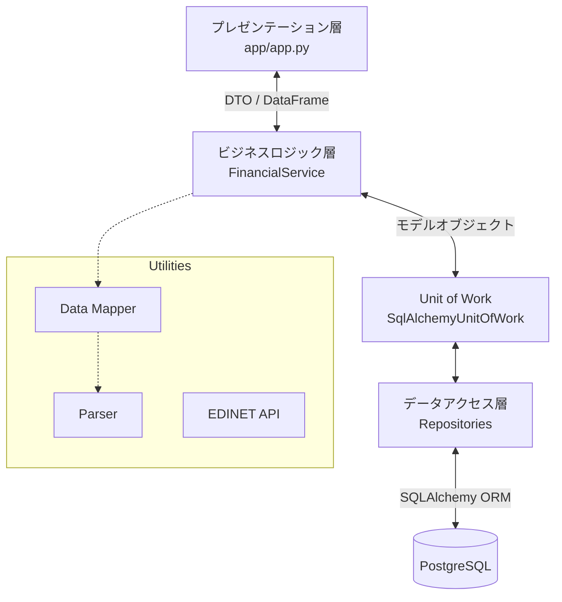
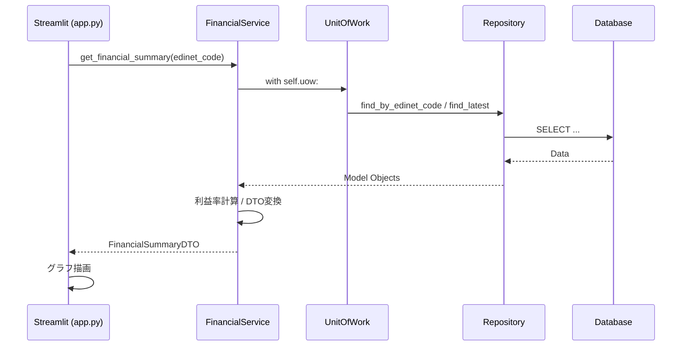

# IR分析プロジェクト：システム設計ドキュメント (最新版)

## 1. システム概要
本システムは、EDINET（金融庁の電子開示システム）から取得したXBRL/CSV形式の財務データを解析し、データベースへの蓄積およびStreamlitによる可視化を行うアプリケーションです。
保守性、拡張性、テスト容易性を最大化するため、モダンなPython開発のベストプラクティスに基づいた設計を採用しています。

---

## 2. アーキテクチャ全体像
厳密な **3層アーキテクチャ** を採用し、各レイヤーの責務を明確に分離しています。



### 2.1. プレゼンテーション層 (Presentation Layer)
- **主要ファイル:** `app/app.py` (Streamlit)
- **役割:** ユーザーインターフェースの構築、入力受付、結果表示。
- **原則:** ビジネスロジックやDB操作（SQL/ORM）を直接行わず、Service層から返されたDTOやDataFrameのみを扱います。

### 2.2. ビジネスロジック層 (Business Logic Layer)
- **主要ファイル:** `utils/service/financial_service.py`
- **役割:** アプリケーション固有の計算（利益率算出など）、データ永続化の調整、DTOへの変換。
- **原則:** `Unit of Work` を通じてリポジトリを操作し、単一のトランザクション内で一貫したデータ処理を行います。

### 2.3. データアクセス層 (Data Access Layer)
- **主要ファイル:** `utils/repositories/`, `utils/db_models.py`
- **役割:** DBへのCRUD操作の隠蔽、モデルオブジェクトの提供。
- **原則:** ビジネスロジックを持たず、純粋なデータ操作に特化します。

---

## 3. 主要デザインパターンとプラクティス

### 3.1. Repository Pattern (リポジトリパターン)
DB操作を抽象化し、データソースへのアクセスをカプセル化します。
- `BaseRepository`: 共通のCRUD操作（get, add, delete, upsert）を提供。
- 各具象クラス (`CompanyRepository` など): モデル固有のクエリ（`find_by_edinet_code` など）を実装。

### 3.2. Unit of Work Pattern (ユニットオブワーク)
複数のリポジトリを束ね、データベーストランザクションを一元管理します。
- `with uow:` ブロックを使用することで、処理成功時に自動コミット、失敗時に自動ロールバックを実現します。
- Service層に対して「唯一のDB窓口」として機能します。

### 3.3. Dependency Injection (依存性の注入)
Serviceクラスは特定のDBセッションに依存せず、外部から `UnitOfWork` を受け取ることでテスト容易性を高めています（DI）。

### 3.4. DTO (Data Transfer Object)
層間のデータ受け渡しに、モデルオブジェクトではなく専用の構造体（`FinancialSummaryDTO`）を使用します。これにより、UIが必要なデータに最適化されたインターフェースを提供し、DBモデルの変更がUIに直接影響するのを防ぎます。

---

## 4. データ解析とマッピング

### 4.1. Data Mapper (`data_mapper.py`)
外部ソース（DataFrame）から内部モデル（Company, Financial_report等）への変換を担います。
- `standardize_raw_data`: カラム名の正規化、数値/テキストの分離。
- `map_data_to_models`: `config.toml` に基づいたマッピング処理。

### 4.2. Parser (`parser.py`)
非構造化テキストからのデータ抽出を行います。
- `extract_fiscal_year`: 和暦/西暦混在の日付範囲から会計年度を特定。
- `extract_quarter_type`: 漢数字/全角数字を含む文字列から四半期（Q1〜Q4）を特定。

---

## 5. データフロー (主要ユースケース)

### 5.1. 財務サマリーの表示フロー


### 5.2. データの永続化フロー (CSV読み込み時)
1. `api.py` がCSVをDataFrameとして取得。
2. `FinancialService.save_financial_data_from_dataframe` を実行。
3. `data_mapper` が各モデル用の辞書を作成。
4. `UnitOfWork` を開始。
5. 各 `Repository` が `upsert` または `add` を実行。
6. `with` ブロック終了時に自動コミット。

---

## 6. ディレクトリ構造の役割
```text
utils/
├── api.py              # EDINET APIとの通信・ファイル取得
├── config_loader.py    # config.tomlの安全な読み込み
├── data_mapper.py      # DataFrame <-> Model の変換
├── db_models.py        # SQLAlchemyによるモデル定義
├── parser.py           # テキスト解析ヘルパー
├── repositories/       # データアクセス層（Repository）
└── service/            # ビジネスロジック層（Service, UoW）
```
---

## 7. テスト環境の分離とテスト実行フロー

### 7.1. テスト環境の分離原則
本システムでは、**本番環境とテスト環境を厳密に分離**し、以下の原則に従っています：

- **独立したDB**: テスト用に `mydatabase_test` を使用
- **DB名による安全性確保**: `_test` サフィックス必須
- **環境変数による制御**: `DB_NAME_TEST` を分離
- **自動クリーンアップ**: テスト完了後、`drop_all` でスキーマ削除

### 7.2. conftest.py フィクスチャ設計
- `engine` (scope=session): 環境変数チェック、`_test` 判定、`Base.metadata.create_all`、`drop_all`。
- `db_session` (scope=function): 各テスト前のデータ削除、コミット/ロールバック管理。

### 7.3. docker-compose テスト環境立ち上げコマンド
テスト環境では、`docker-compose.yml` を使用してテスト用 DB （`mydatabase_test`）を分離起動します。

#### 実行手順（推奨フロー）

**ステップ1：テスト環境の起動**
```bash
# Linux/macOS
docker compose up --build -d

# Windows PowerShell
docker compose up --build -d
```

**ステップ2：DB スキーマ初期化（conftest.py 自動処理）**
スキーマ初期化は `conftest.py` の `engine` フィクスチャが自動で処理するため、手動実行は不要です。

**ステップ3：テスト実行**
```bash
# Linux/macOS
docker compose exec streamlit_app pytest tests/

# Windows PowerShell
docker compose exec -T streamlit_app pytest tests/
```

**ステップ4：クリーンアップ**
```bash
docker compose down
```

> 詳細は [TEST_EXECUTION_GUIDE.md](../TEST_EXECUTION_GUIDE.md) を参照してください。


### 7.4. テスト実行フェーズ
1. テスト用DB起動（`db`コンテナ）
2. `conftest.py::engine` フィクスチャ実行、テスト環境のDBスキーマ作成
3. `pytest tests/` 実行
4. `conftest.py` で `create_all` → 各テストで `db_session` → `rollback` → 最後に `drop_all`
5. コンテナ停止・削除 (or CIの`down`)

### 7.5. `conftest.py` の活用（テスト初期化）
`conftest.py` は、テスト実行時に自動的にDBスキーマを初期化し、クリーンアップするフィクスチャを提供します。

#### 7.5.1. `engine` フィクスチャ (scope=session)
テストセッション開始時に、**スキーマを初期化** し、終了時に削除します：

- `.env` から `DB_NAME_TEST=mydatabase_test` を取得
- DB名が `_test` で終わることを検証
- `Base.metadata.create_all()` でテーブル作成
- テスト終了後に `drop_all()` でスキーマ削除
```bash
  python /scripts/bypass_import_csv.py --init-only
```

このオプションにより、テスト環境の準備時間を短縮でき、各テスト実行時に `conftest.py` の `engine` フィクスチャが再度スキーマを作成することと組み合わせて、**完全にクリーンなテスト環境** を実現します。

#### 7.5.2. `db_session` フィクスチャ (scope=function)
各テスト関数実行前に、**データをクリーン** にし、独立性を確保します：

- 既存データをすべて削除（`DELETE FROM` クエリ）
- 新しいセッションを提供
- テスト終了時に自動ロールバック

#### 7.5.3. 実装詳細
- `conftest.py` で `load_dotenv()` を実行
- `DB_NAME_TEST` 環境変数を取得し、`_test` サフィックスを検証
- `engine` フィクスチャで `Base.metadata.create_all()` を実行
- テスト終了時に `Base.metadata.drop_all()` でスキーマ削除
- ログレベルを `logger.info()` で統一し、実行状況を可視化

